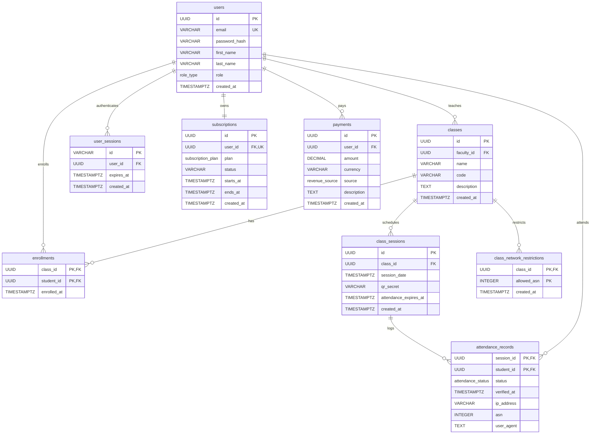

# Diagrams

## Data Model (mid-point pitch)

```mermaid
erDiagram
    users {
        UUID id PK
        VARCHAR email UK
        VARCHAR password_hash
        VARCHAR first_name
        VARCHAR last_name
        role_type role
        TIMESTAMPTZ created_at
    }

    user_sessions {
        VARCHAR id PK
        UUID user_id FK
        TIMESTAMPTZ expires_at
        TIMESTAMPTZ created_at
    }

    subscriptions {
        UUID id PK
        UUID user_id FK
        subscription_plan plan
        VARCHAR status
        TIMESTAMPTZ starts_at
        TIMESTAMPTZ ends_at
        TIMESTAMPTZ created_at
    }

    payments {
        UUID id PK
        UUID user_id FK
        DECIMAL amount
        VARCHAR currency
        revenue_source source
        TEXT description
        TIMESTAMPTZ created_at
    }

    classes {
        UUID id PK
        UUID faculty_id FK
        VARCHAR name
        VARCHAR code
        TEXT description
        TIMESTAMPTZ created_at
    }

    enrollments {
        UUID class_id PK, FK
        UUID student_id PK, FK
        TIMESTAMPTZ enrolled_at
    }

    class_sessions {
        UUID id PK
        UUID class_id FK
        TIMESTAMPTZ session_date
        VARCHAR qr_secret
        TIMESTAMPTZ attendance_expires_at
        TIMESTAMPTZ created_at
    }

    class_network_restrictions {
        UUID class_id PK, FK
        INTEGER allowed_asn PK
        TIMESTAMPTZ created_at
    }

    attendance_records {
        UUID session_id PK, FK
        UUID student_id PK, FK
        attendance_status status
        TIMESTAMPTZ verified_at
        VARCHAR ip_address
        INTEGER asn
        TEXT user_agent
    }

    users ||--o{ user_sessions : "authenticates"
    users ||--o| subscriptions : "owns"
    users ||--o{ payments : "pays"
    users ||--o{ classes : "teaches"
    users ||--o{ enrollments : "enrolls"
    users ||--o{ attendance_records : "attends"
    classes ||--o{ class_sessions : "schedules"
    classes ||--o{ class_network_restrictions : "restricts"
    class_sessions ||--o{ attendance_records : "logs"
    classes ||--o{ enrollments : "has"
```

## Data Model (final)

```mermaid
erDiagram
    %% Relationships
    users ||--o{ classes : "teaches"
    users ||--o{ enrollments : "enrolls"
    classes ||--o{ enrollments : "has"
    classes ||--o{ class_sessions : "schedules"
    class_sessions ||--o{ attendance_records : "logs"
    users ||--o{ attendance_records : "attends"
    classes ||--o{ class_network_restrictions : "restricts"
    users ||--o{ user_sessions : "authenticates"
    users ||--|| subscriptions : "owns"
    users ||--o{ payments : "pays"

    %% Entities
    users {
        UUID id PK
        VARCHAR email UK
        VARCHAR password_hash
        VARCHAR first_name
        VARCHAR last_name
        role_type role
        TIMESTAMPTZ created_at
    }

    classes {
        UUID id PK
        UUID faculty_id FK
        VARCHAR name
        VARCHAR code
        TEXT description
        TIMESTAMPTZ created_at
    }

    enrollments {
        UUID class_id PK, FK
        UUID student_id PK, FK
        TIMESTAMPTZ enrolled_at
    }

    class_sessions {
        UUID id PK
        UUID class_id FK
        TIMESTAMPTZ session_date
        VARCHAR qr_secret
        TIMESTAMPTZ attendance_expires_at
        TIMESTAMPTZ created_at
    }

    attendance_records {
        UUID session_id PK, FK
        UUID student_id PK, FK
        attendance_status status
        TIMESTAMPTZ verified_at
        VARCHAR ip_address
        INTEGER asn
        TEXT user_agent
    }

    class_network_restrictions {
        UUID class_id PK, FK
        INTEGER allowed_asn PK
        TIMESTAMPTZ created_at
    }

    user_sessions {
        VARCHAR id PK
        UUID user_id FK
        TIMESTAMPTZ expires_at
        TIMESTAMPTZ created_at
    }

    subscriptions {
        UUID id PK
        UUID user_id FK, UK
        subscription_plan plan
        VARCHAR status
        TIMESTAMPTZ starts_at
        TIMESTAMPTZ ends_at
        TIMESTAMPTZ created_at
    }

    payments {
        UUID id PK
        UUID user_id FK
        DECIMAL amount
        VARCHAR currency
        revenue_source source
        TEXT description
        TIMESTAMPTZ created_at
    }
```
