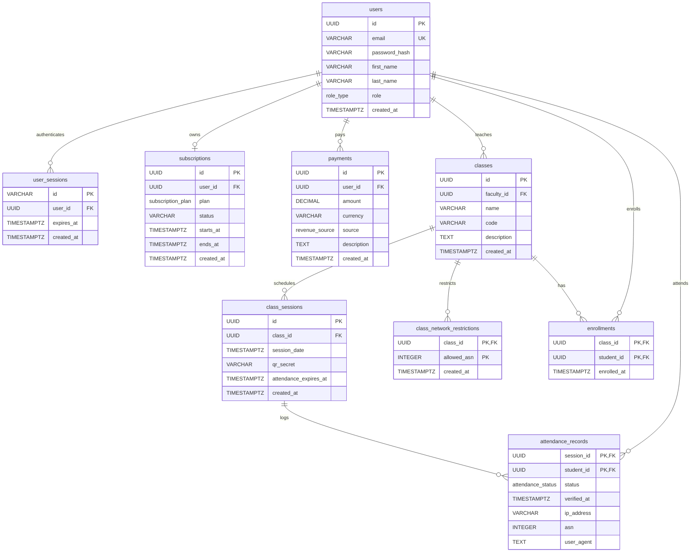
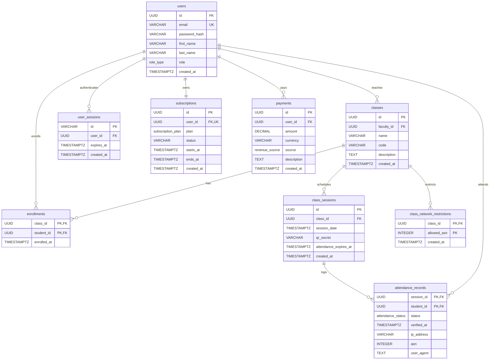
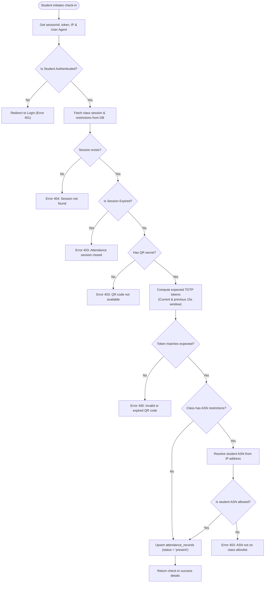
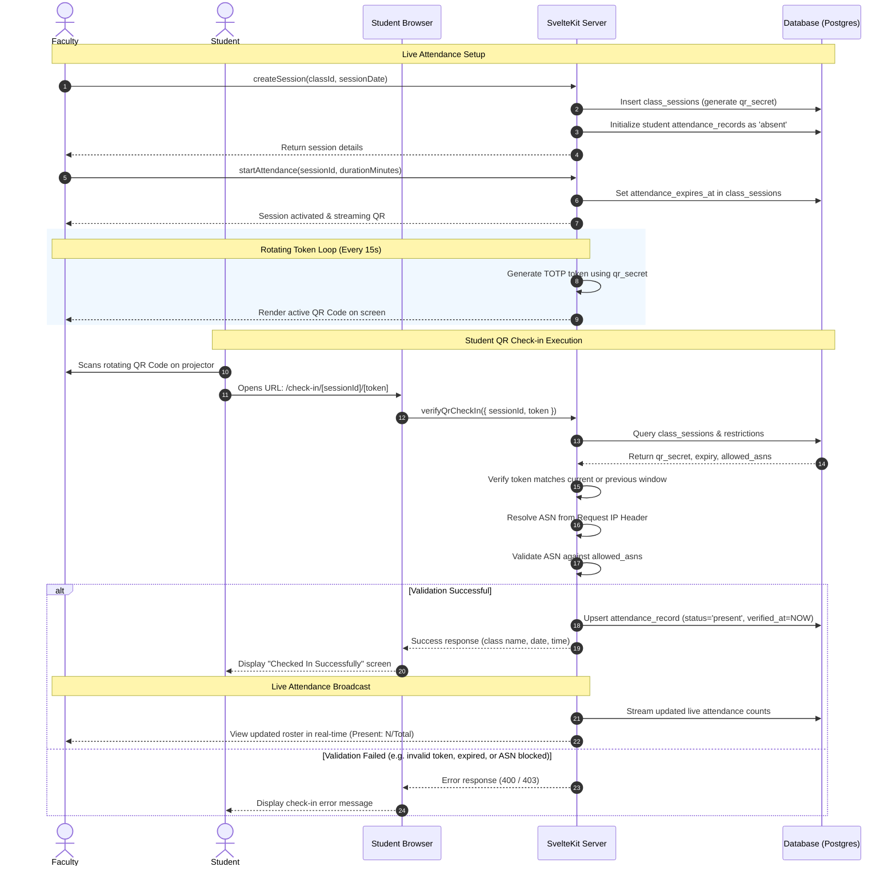
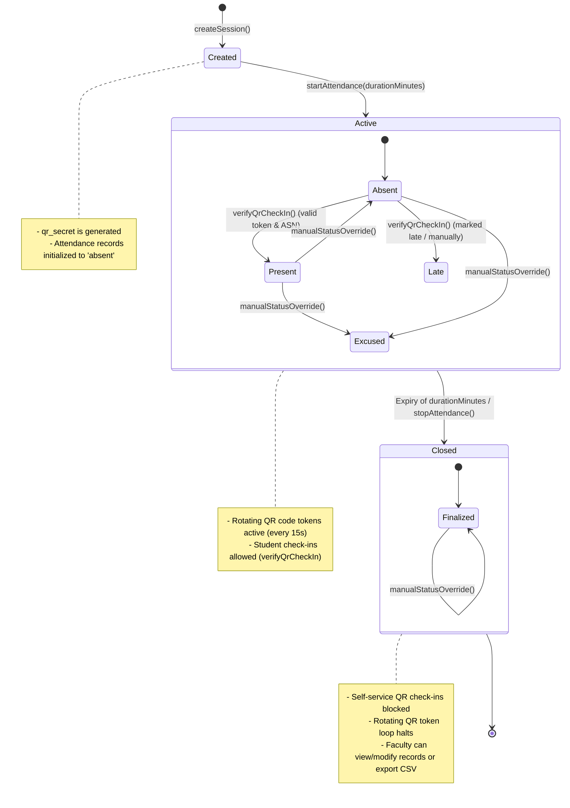

# Diagrams

## Data Model (mid-point pitch)

## Data Model (final)

## Check-in Verification Flow (Activity Diagram)

This flowchart details the execution steps of the `verifyQrCheckIn` remote function when a student scans a QR code and attempts to record their attendance.

## Secure QR Check-in Sequence (Sequence Diagram)

This sequence diagram displays the step-by-step communication between the Faculty, Student, Student's Browser, SvelteKit Server (Remote Functions/RPC), and the Database during a secure rotating QR code attendance session.

## Session & Attendance Lifecycle (State Diagram)

This state diagram models the states and transitions of a Class Session and the corresponding student attendance record states.

